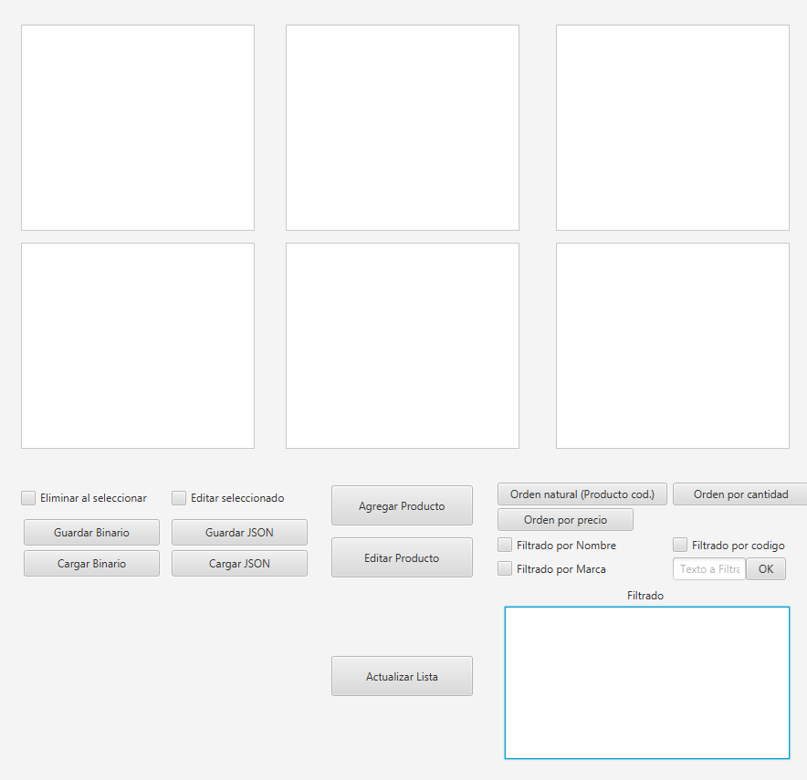
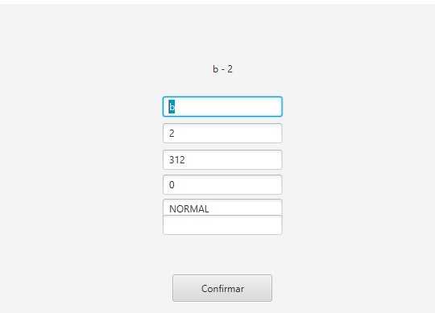
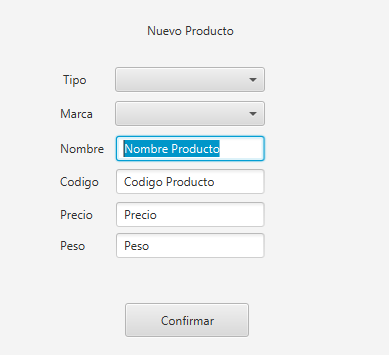
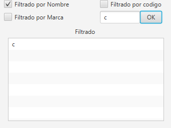

# Productos - CRUD

*Soy Jeronimo Vilar, tengo 21 años y estoy en el segundo cuatrimestre de la Tecnicatura en Programacion*  

*La aplicacion en bastante simple, para elimianr o editar un producto, debes tildar la check box, y luego con click, seleccionas un elemento, en el caso de eliminar se elimina automaticamente, en el caso de editar, luego de seleccionar debes tocar el boton de Editar Producto* 

Estas dos imagenes que tenemos abajo son los recuadros de crear y de editar, ambos funcionan de igual forma, lo unico a tener consideracion es rellenar todos los campos y respetar los tipos de datos, por ejemplo codigo, precio y peso son enteros, por lo cual deberas usar solo enteros, o dara Error. Luego de editar o crear, deberas apretar el boton de actualizar en la pantalla principal

A rasgos generales, eplicare el resto, en la parte izquierda, debajo de los chechbox, hay botones que te dan la opcion de guardar la informacion, funcionan simplemente tocandolos, no hay que hacer mas que eso.

En la parte de la derecha veraz la seccion de filtrado y orden, en los que dicen "orden", deberas solo clickear el orden que quieres y se mostrara en pantalla. El filtrado, seleccionando la checkbox que quieras e ingresando el texto por el cual quieras filtrar, mostrara los resultados en la listview debajo de los checklist
